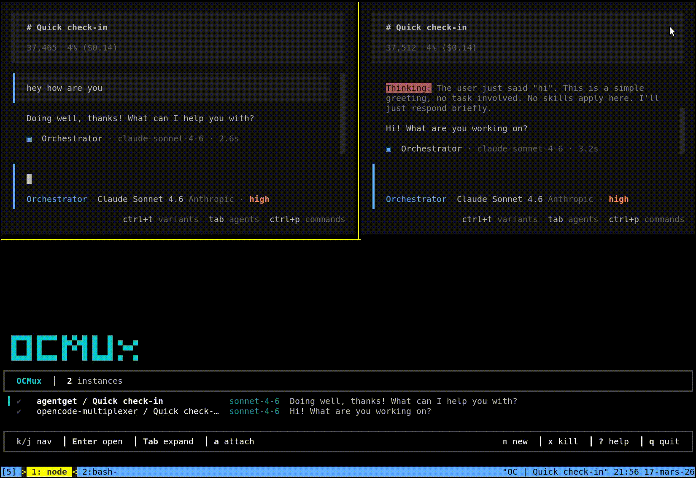
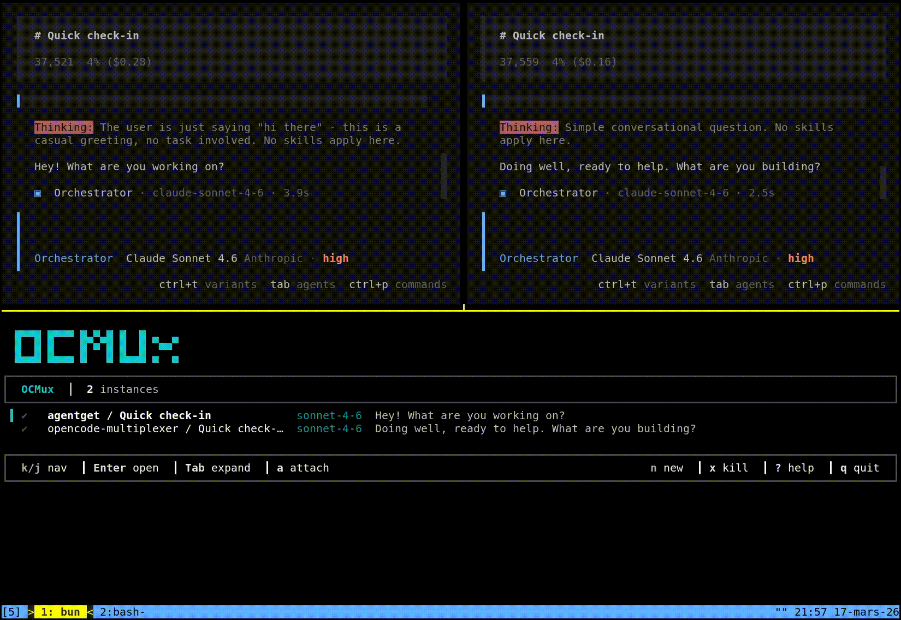
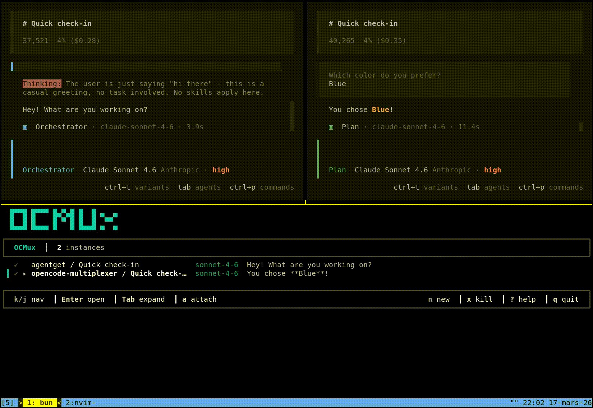

# OCMux — OpenCode Multiplexer

[](https://www.npmjs.com/package/opencode-multiplexer)
[](#requirements)
[](./LICENSE)
[](https://opencode.ai)

A terminal multiplexer for [opencode](https://opencode.ai) AI coding agent sessions.

**Run multiple opencode sessions across different projects from one fast, focused dashboard**—see which agents are working, idle, blocked on your input, or failing, then jump into the right session instantly.

When you're juggling several repositories at once, OCMux removes the friction of switching panes, losing context, and missing the moment an agent needs you.

## Demo

### Instantly see your current sessions and attach to existing work



> OCMux stays responsive to your existing working sessions and lets you attach to them without hunting through terminal panes.

### Track agent status, subagents, and sessions that need your attention



> Live status indicators show whether an agent is working, idle, or waiting on you. You can also inspect subagents and attach to them directly.

### Start new sessions or kill existing ones without leaving the dashboard



> Spawn a new session, jump into it immediately, or terminate a session right from OCMux.

## Install

### Requirements

- [Bun](https://bun.sh) runtime
- [opencode](https://opencode.ai) installed and available on `PATH`
- macOS or Linux
- Optional: [fzf](https://github.com/junegunn/fzf) for the folder picker when spawning new sessions

### Install from npm

```bash
# install
npm install -g opencode-multiplexer

# to run, run
ocmux
# or
opencode-multiplexer
```

### Run from source

```bash
git clone https://github.com/joeyism/opencode-multiplexer
cd opencode-multiplexer
bun install
bun src/index.tsx
```

## Features

OCMux gives you a single TUI for managing several opencode sessions at once.

- Dashboard view showing all running opencode sessions with live status indicators (working, needs input, idle, error)
- Expandable subagent tree per session, showing what child agents are running and their status
- Read conversation history for any session without attaching to it
- Send messages directly to sessions spawned via OCMux (which run a background HTTP server)
- Cycle through agent modes (Orchestrator, Chat, Code) and models per session
- Spawn new sessions with a folder picker, attaching immediately to the new session
- Kill instances directly from the dashboard
- Vim-style navigation throughout (`j`/`k`, `Ctrl-U`/`Ctrl-D`, `G`/`gg`)

## Usage

### Overview

When working with several opencode sessions simultaneously across different repositories, switching between terminal panes and losing track of which agent needs attention becomes a friction point. OCMux addresses this by providing a single TUI that aggregates all running opencode instances, shows their real-time status, and lets you jump between them efficiently.

### How it works

OCMux discovers opencode instances in two ways:

**Existing sessions** (started outside OCMux): OCMux scans for running `opencode` processes using `ps`, identifies their working directories, and matches them to sessions in the shared opencode SQLite database at `~/.local/share/opencode/opencode.db`. These sessions are read-only in OCMux — you can view the conversation history, but to send messages you must attach to the TUI.

**Spawned sessions** (started via OCMux): When you create a new session from within OCMux, it starts `opencode serve --port X` as a background process. This exposes an HTTP API that OCMux uses to send messages directly, cycle agent modes, and list available models. The session persists after you leave the conversation view.

The dashboard polls every 2 seconds and updates status indicators automatically.

### Dashboard

```text
  OCMux
  [Orchestrator] opus-4-6  [NORMAL]  73%
 ─────────────────────────────────────────────────────────────────────────
  ● ▸ project-api / Refactor auth module      working...
  ◐   project-web / Fix the payment flow      "Should I also update tests?"
  ○ ▸ project-infra / Deploy script fix       idle
 ─────────────────────────────────────────────────────────────────────────
  k/j: nav  Enter: open  Tab: expand  a: attach  x: kill  n: new  q: quit
```

#### Status indicators

| Symbol | Meaning |
|--------|---------|
| `●` green | Agent is currently generating |
| `◐` yellow | Agent finished, waiting for your next message |
| `○` white | Idle |
| `✗` red | Error in the last tool call |

Pressing `Tab` on an instance expands its subagent tree, showing what child sessions are running beneath it. Each child shows its agent type (`[fixer]`, `[explorer]`, etc.), title, model, and how long ago it was active. Subagents can themselves be expanded if they spawned further children.

### Spawned vs discovered sessions

Sessions spawned via OCMux (`n`) run as `opencode serve --port X` in the background. These sessions:

- Show `[live]` in the conversation header
- Support inline messaging from the conversation view
- Allow cycling agent modes with `Tab`
- Persist when you exit the conversation view
- Can be killed from the dashboard with `x`

Sessions discovered from existing `opencode` processes show `[read-only]`. These support:

- Full conversation history viewing
- Attaching to the TUI with `a` or `i` to send messages
- Agent mode display (read from the last assistant message)

## Keybindings

### Dashboard

| Key | Action |
|-----|--------|
| `j` / `k` or arrows | Navigate up/down |
| `Enter` | Open conversation view |
| `a` | Attach to opencode TUI |
| `Tab` | Expand subagent tree |
| `Shift-Tab` | Collapse subagent tree |
| `Ctrl-N` | Jump to next session needing input |
| `n` | Spawn new session |
| `x` | Kill selected instance (with confirmation) |
| `r` | Refresh instance list |
| `?` | Toggle help overlay |
| `q` | Quit |

### Conversation view

| Key | Action |
|-----|--------|
| `j` / `k` or arrows | Scroll one line |
| `Ctrl-U` / `Ctrl-D` | Scroll half page |
| `Ctrl-F` / `Ctrl-B` | Scroll full page |
| `G` | Jump to bottom |
| `gg` | Jump to top |
| `i` | Enter insert mode (type a message) |
| `Esc` | Exit insert mode / go back |
| `q` | Go back to dashboard |
| `a` | Attach to opencode TUI |
| `Tab` | Cycle agent mode (live sessions only) |
| `Shift-Tab` | Cycle model override (live sessions only) |

### Insert mode (live sessions only)

| Key | Action |
|-----|--------|
| `Enter` | Send message |
| `Ctrl-X E` | Open current text in `$EDITOR` |
| `Esc` | Exit insert mode, return to normal mode |

## Configuration

Config file: `~/.config/ocmux/config.json`

All fields are optional. Unspecified fields use the defaults shown below.

```json
{
  "keybindings": {
    "dashboard": {
      "up": "k",
      "down": "j",
      "open": "return",
      "attach": "a",
      "spawn": "n",
      "expand": "tab",
      "collapse": "shift-tab",
      "nextNeedsInput": "ctrl-n",
      "kill": "x",
      "quit": "q",
      "help": "?",
      "rescan": "r"
    },
    "conversation": {
      "back": "escape",
      "attach": "a",
      "send": "return",
      "scrollUp": "k",
      "scrollDown": "j",
      "scrollHalfPageUp": "ctrl-u",
      "scrollHalfPageDown": "ctrl-d",
      "scrollPageUp": "ctrl-b",
      "scrollPageDown": "ctrl-f",
      "scrollBottom": "G",
      "scrollTop": "g"
    }
  },
  "pollIntervalMs": 2000,
  "dbPath": "~/.local/share/opencode/opencode.db"
}
```

## Architecture

OCMux reads session data directly from opencode's SQLite database (`~/.local/share/opencode/opencode.db`), which it shares with the opencode TUI. This means it sees all sessions instantly without any IPC or polling overhead beyond the 2-second refresh cycle.

For live sessions, OCMux communicates with the background `opencode serve` process via the `@opencode-ai/sdk` HTTP client.

The TUI is built with [Ink](https://github.com/vadimdemedes/ink) (React for terminals) and [Zustand](https://github.com/pmndrs/zustand) for state management.
